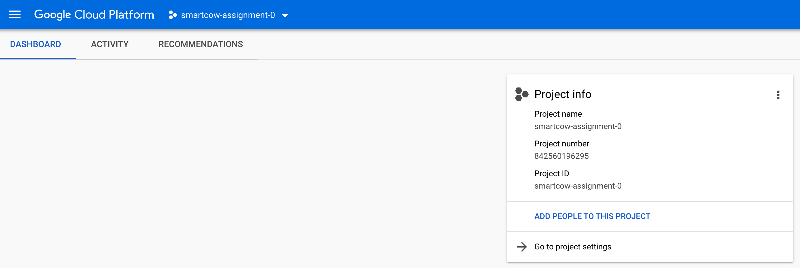
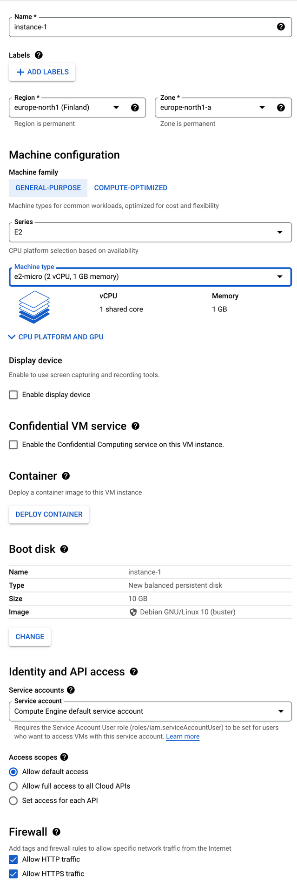

## Task 2 - Deploy on Cloud

Next step is to deploy this application to absolutely any cloud of your choice. 

> It's important to remember here that the application is already containerize, maybe you could deploy it to services which take an advantage of that fact. (example, AWS EBS?)

You could use any other cloud service provider of your choice too. Use the smallest instance size available to save up on the cloud costs. 

The React App should be accessible on a public URL, that's the only hard requirement. 

Use the best practices for exposing the cloud VM to the internet, block access to unused ports, add a static IP (elastic IP for AWS), create proper IAM users and configure the app exactly how you would in production. Write a small document to explain your approach.

You will be evaluated based on the

* best practices
* quality of the documentation provided with the code

---

## Task 2 - Documentation

URL: https://test.josefmagri.online/

This task can be done in multiple ways. Since no specific hard-requirements where defined, it was decided to be done on a Compute Instance in GCP.

A GCP account was setup and project created accordingly.



A VM instance was set-up from the GUI with the following specs:
- Name: instance-1
- Region was set to `europe-north1` and zone `europe-north1-a`
- A general-purpose machine with machine type `e2-micro (2 vCPU, 1 GB memory)
- Service account was set to `Compute Engine default service account` (this will automatically define a service user account with the necessary IAM role)
- The scope was set to `default access` (define the default OAuth scopes used in requests from the gcloud CLI or the client libraries)
- Firewall was set to allow HTTP trafic and HTTPS trafic. 
- Debian machine was selected.

By default the machine will be initiated with a private and public (empheral ip) and since the firewall check boxes where checked, GCP will set up firewall rules to expose port 80 and 433 to the internet.

The public IP was then changed to reserved `Premium` so that it is kept static.




----

## Project Setup

First Nginx was installed
- `sudo apt-get update`
- `sudo apt-get install nginx`
- `sudo nginx -v`


Secondly Docker and Docker compose where setup.
The project files where then pushed via scp to the machine and docker compose of task 1 was setup on the machine.

The URL for the fetch of stats in app.js was changed accordingly.

Nginx Config

```
upstream sys-stats {
  server 0.0.0.0:3000;
}

upstream api {
  server 0.0.0.0:8000;
}

server {
    listen 80;
    listen [::]:80;
    server_name test.josefmagri.online www.test.josefmagri.online;
    return 302 https://$server_name$request_uri;
}

server {
  
    # SSL configuration

    listen 443 ssl http2;
    listen [::]:443 ssl http2;
    ssl_certificate         /etc/ssl/cert.pem;
    ssl_certificate_key     /etc/ssl/key.pem;
    ssl_client_certificate /etc/ssl/cloudflare.crt;
    ssl_verify_client on;

    server_name test.josefmagri.online www.test.josefmagri.onlin;

    location / {
      proxy_pass http://sys-stats;
    }
	
    location /stats {
      rewrite /stats/(.*) /$1 break;
      proxy_pass http://api;
    }
}
```

SSL and client and origin certificates where setup with cloudflare.
Reference: https://www.digitalocean.com/community/tutorials/how-to-host-a-website-using-cloudflare-and-nginx-on-ubuntu-20-04